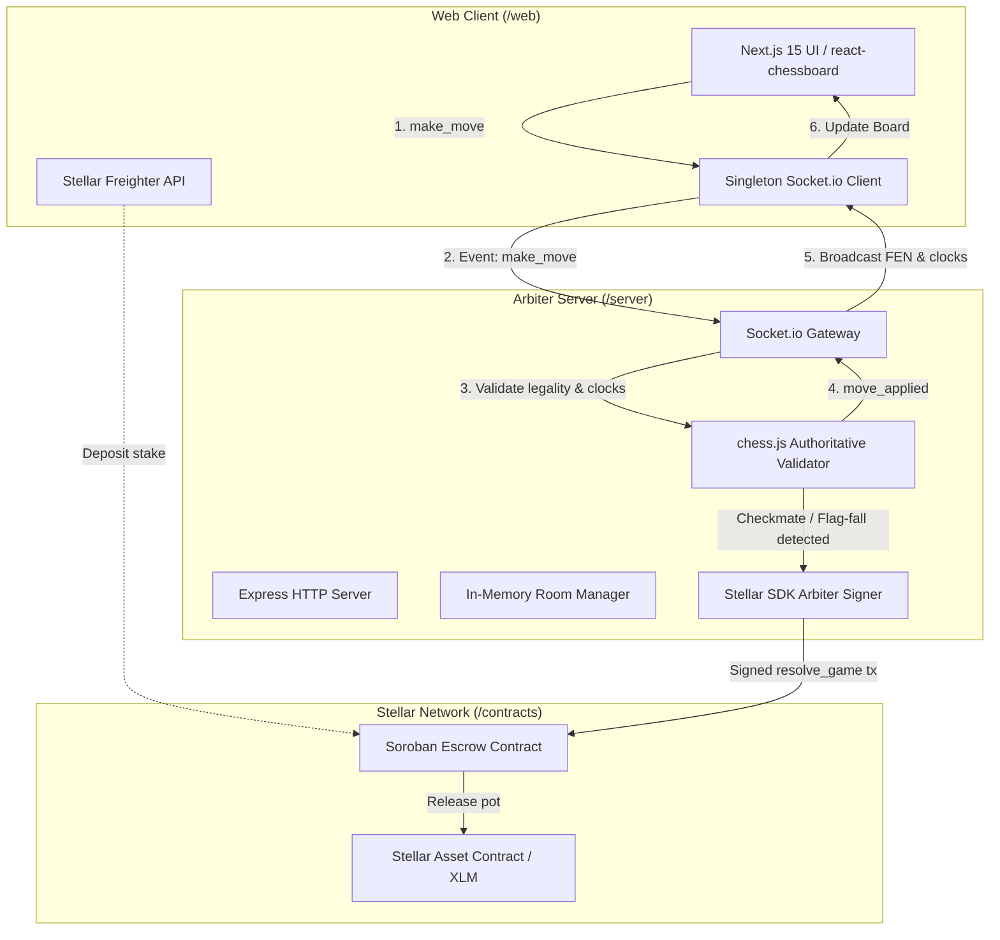

# 🏰 Castle Black

> **"Chess first. Blockchain where it actually adds value."**

[](https://opensource.org/licenses/MIT)
[](https://stellar.org)
[](https://soroban.stellar.org)
[](https://nextjs.org)
[](https://www.typescriptlang.org)
[](./contracts)

**Castle Black** is an open-source, real-time chess platform built for speed, simplicity, and trustless competition on the **Stellar** network. It merges zero-friction web play with authoritative server arbitration and Soroban smart contract escrow wagers.

---

## 🎯 Problem & Product Philosophy

### The Web3 Gaming Anti-Pattern
Most Web3 gaming experiences place the blockchain in the way of user enjoyment:
- Forcing wallet installation before seeing the board.
- Requiring blockchain signatures and gas fees for individual moves.
- Introducing latency and friction into what should be an instantaneous game.

### The Castle Black Solution
1. **Zero-Friction Casual Play**: No account, no wallet, and no setup required. Two players simply share a **6-character room code** (e.g. `KN7X9P`) to play lightning-fast, real-time chess.
2. **Blockchain Where It Actually Adds Value**: Stellar and Soroban are used strictly for **optional, trustless wager escrow**:
   - Both players deposit equal testnet XLM/tokens into a Soroban smart contract.
   - The authoritative game arbiter cryptographically verifies the match outcome (checkmate, timeout, resignation).
   - The arbiter triggers the Soroban contract to release 100% of the pot directly to the winner's wallet.
3. **Why Stellar?**
   - **Sub-5 second finality**: Instant escrow payouts the moment checkmate lands.
   - **Near-zero transaction fees**: Low friction for micro-stakes and casual matches.
   - **Soroban Rust safety**: Formally verifiable state transitions with native asset contract (SAC) support.

---

## 🏛️ System Architecture

Castle Black is structured as a high-cohesion, low-coupling monorepo:

```
castle-black/
├── web/           # Next.js 15+ App Router, Tailwind CSS, react-chessboard, Freighter API
├── server/        # Express + Socket.io authoritative game arbiter & Stellar SDK service
└── contracts/      # Minimal Soroban Rust 2-player escrow contract with arbiter release
```

### Architecture Diagram



### Component Breakdown

| Module | Core Technologies | Primary Responsibility |
| :--- | :--- | :--- |
| **`/web`** | Next.js 15, React 19, Tailwind CSS, `react-chessboard`, `@stellar/freighter-api` | Zero-login match lobby, reactive board UI, synchronized dual clocks, Freighter wallet integration. |
| **`/server`** | Node.js, Express, Socket.io, TypeScript, `chess.js`, `@stellar/stellar-sdk` | Authoritative move validation, in-memory room management, millisecond clock ticking, testnet keypair arbiter resolution. |
| **`/contracts`** | Rust, Soroban SDK `22.0.0`, WebAssembly | Multi-player escrow contract locking matching stakes and releasing pots exclusively upon verified arbiter authorization. |

---

## ⚡ Quickstart Guide

### Prerequisites
- **Node.js**: `v20.0.0` or higher (tested on Node 24)
- **Rust**: `1.80+` with `wasm32-unknown-unknown` target (for contract compilation)
- **Git**

---

### 1. Clone the Repository
```bash
git clone https://github.com/Stanley471/castle-black.git
cd castle-black
```

---

### 2. Start the Arbiter Server (`/server`)
```bash
cd server
npm install
npm run dev
```
> The server will start on port `4000`. If no `ARBITER_SECRET_KEY` is provided in `.env`, it automatically boots with a transient simulation keypair so casual chess matches work out of the box with zero configuration!

---

### 3. Start the Web Client (`/web`)
In a new terminal window:
```bash
cd web
npm install
npm run dev
```
> Open [http://localhost:3000](http://localhost:3000) in your browser. Click **"Create Match & Get Code"** to generate an instant 6-character room code and play!

---

### 4. Run Smart Contract Unit Tests (`/contracts`)
In a new terminal window:
```bash
cd contracts
cargo test
```

---

## 🛡️ Smart Contract Verification

The escrow contract (`contracts/src/lib.rs`) is written in `#![no_std]` Rust using `soroban-sdk = "22.0.0"`.

### Test Suite Execution
Run `cargo test` inside `/contracts`:
```text
running 4 tests
test test::test_cannot_play_self - should panic ... ok
test test::test_cancel_game_lifecycle ... ok
test test::test_full_escrow_lifecycle ... ok
test test::test_invalid_winner - should panic ... ok

test result: ok. 4 passed; 0 failed; 0 ignored; 0 measured; 0 filtered out; finished in 0.19s
```

### Verified Test Cases:
1. **`test_full_escrow_lifecycle`**:
   - Creator locks 100 tokens.
   - Opponent locks 100 tokens.
   - Contract holds 200 tokens in escrow.
   - Arbiter authorizes payout to White upon verified victory.
   - White receives 200 tokens (100% of the pot); contract balance returns to 0.
2. **`test_cancel_game_lifecycle`**:
   - Creator locks 50 tokens.
   - Creator cancels match before an opponent joins.
   - Contract refunds 100% of the deposit back to creator; status transitions to `Cancelled`.
3. **`test_cannot_play_self`**:
   - Verifies that creator cannot join their own game as opponent.
4. **`test_invalid_winner`**:
   - Verifies that attempting to release the pot to a third-party non-participant reverts with `InvalidWinner`.

---

### Deploying to Stellar Testnet

1. **Install the Stellar CLI**:
   ```bash
   cargo install --locked stellar-cli --features opt
   ```

2. **Configure and Fund Testnet Keypair**:
   ```bash
   stellar keys generate arbiter --network testnet
   stellar keys fund arbiter --network testnet
   ```

3. **Build the Optimized WebAssembly Binary**:
   ```bash
   cd contracts
   cargo build --target wasm32-unknown-unknown --release
   ```

4. **Deploy Contract**:
   ```bash
   stellar contract deploy \
     --wasm target/wasm32-unknown-unknown/release/castle_black_escrow.wasm \
     --source arbiter \
     --network testnet
   ```

5. **Link to Server**:
   Copy the returned Contract ID into `/server/.env`:
   ```env
   ESCROW_CONTRACT_ID=CA...YOUR_CONTRACT_ID
   ```

---

## 🗺️ Roadmap & Good First Issues

Castle Black welcomes community contributions under the Drips Wave maintainer track! Here are 4 structured **Good First Issues** ready for contributors:

### Issue #1: `feat: PGN move history export & FEN copying`
- **Scope**: `/web` (Frontend)
- **Labels**: `good first issue`, `frontend`, `ui`
- **Description**: Add a "Download PGN" button and a 1-click "Copy FEN" icon next to the move history panel on `/game/[code]`. Enables players to analyze their games on Lichess or Chess.com immediately after the match.

### Issue #2: `feat: Threefold repetition & 50-move draw claim button`
- **Scope**: `/server` & `/web` (Full-Stack)
- **Labels**: `good first issue`, `chess-engine`, `rules`
- **Description**: Expose an explicit "Claim Draw" button when `chess.isThreefoldRepetition()` or `chess.isDraw()` is reachable. If both players agree or condition is met, the arbiter splits the pot 50/50 back to both addresses.

### Issue #3: `feat: Web Audio sound effects for moves, checks, and flag-fall`
- **Scope**: `/web` (UI / Audio)
- **Labels**: `good first issue`, `audio`, `ux`
- **Description**: Integrate lightweight Web Audio API sound effects for piece moves, captures, checks, and low-time tick warnings (<10s) to give players tactile feedback.

### Issue #4: `feat: Multi-token escrow support (USDC & custom Stellar tokens)`
- **Scope**: `/contracts` & `/server` (Soroban & Web3)
- **Labels**: `good first issue`, `soroban`, `stellar`
- **Description**: Extend the lobby token picker so players can wager in testnet USDC or Soroban test tokens in addition to native XLM by passing the SAC address to `create_game`.

---

## 📄 License

Castle Black is released under the **[MIT License](LICENSE)**. Free and open source for the community.
